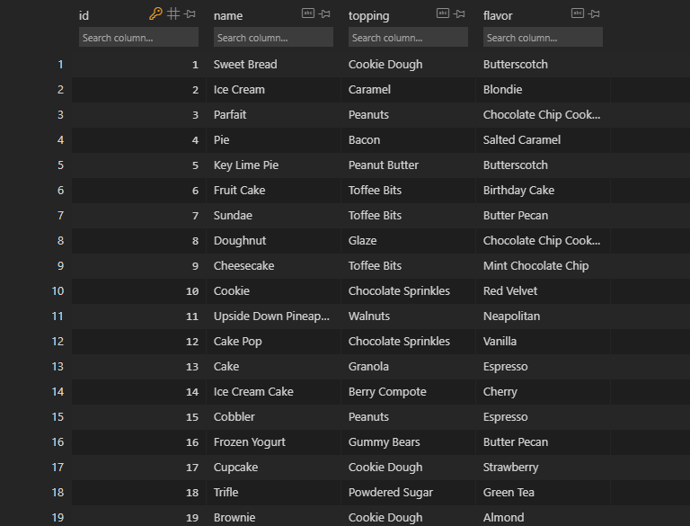

## Introduction

If you are building and testing database schemas that will ultimately be used to house user data, you will need seed data to start. It should be diverse, have significant graulation but also resemble the data you expect the production database to contain. You could, of course, go into your seeds.db file and write something like this:

```
# Add a console message so we can see output when the seed file runs
puts "Seeding games..."

Dessert.create(
name: Cake,
topping: cherries,
flavor: chocolate
)

Dessert.create(
name: Cookie,
topping: chocolate chips,
flavor: sugar
)

Dessert.create(
name: Donut,
topping: sprinkles,
flavor: jelly
)

puts "Done seeding!"
```

That took me about ten minutes to write, and after only three items I was already running out of ideas. Testing database queries on this would be prone to mistakes (with only three entries, you may think you have identified the dessert your query expected to return but be wrong), and also boring to work with. I want to use my ten minutes much more effectively. That's where [Faker](https://github.com/faker-ruby/faker) comes in. It is a Ruby gem which can generate many kinds of randomized data, and by creating different combinations you can ensure diversity in your test database. And because it's broken up into many different categories, you can make your test data look reasonably like real data, except funnier, which will hopefully brighten up your day.

## Installing the gem and browsing the selection

To install it, make sure Ruby itself is installed, and then type

```
gem install faker
```

and you're ready to go. You can browse the list of the categories of fake data at the [GitHub page](https://github.com/faker-ruby/faker). There's lots of very ordinary ones like [names (including first and last names and many other options](https://github.com/faker-ruby/faker/blob/main/doc/default/name.md)), specialized ones like [Etherium blockchain addresses](https://github.com/faker-ruby/faker/blob/main/doc/blockchain/ethereum.md) and then silly and nerdy ones like [Touhou names and spell cards](https://github.com/faker-ruby/faker/blob/main/doc/games/touhou.md). There's even just the one we need for our test database, [desserts](https://github.com/faker-ruby/faker/blob/main/doc/default/dessert.md)!


## Generating random entries in your seeds.db File

Now you have everything you need to create a near unlimited number of unique database entries. Back in your seeds.rb file, start making a loop to execute the Faker gem the number of times you want. Remember that numbers themselves are instances of classes in Ruby, so they inherit methods from their class parent, such as .times for integers.

```
puts "Seeding desserts..."


50.times do
end

puts "Done seeding!"
```

This will execute whatever you put in between the "do" and the "end" 50 times. Next, you need to create the skeleton of a single table row:

```
puts "Seeding desserts..."


50.times do
  Dessert.create(
    name: 
    topping:
    flavor: 
  )
end

puts "Done seeding!"
```

Now it's time to put in the Faker information.

```
puts "Seeding desserts..."


50.times do
  Dessert.create(
    name: Faker::Dessert.variety,
    topping: Faker::Dessert.topping,
    flavor: Faker::Dessert.flavor
  )
end

puts "Done seeding!"
```

One important note: if you need any of the data to be unique, such as usernames, you will need to use the .unique method as part of the call.

```
puts "Seeding desserts..."


50.times do
  Dessert.create(
    name: Faker::Dessert.unique.variety,
    topping: Faker::Dessert.topping,
    flavor: Faker::Dessert.flavor
  )
end

puts "Done seeding!"
```

The downside is that it will generate an error if there are not enough unique items in Faker for all the entries you are trying to create. For this demonstration, I won't be using it. The combination of these three items will create more than enough different desserts.

## The Results

Let's look at all the delicious desserts Faker created.



Would you like some espresso peanut cobbler, or perhaps a mint chocolate chip cheesecake with toffee bits?

I hope this method helps other database developers create test data quickly and easily, and also gives some much-needed enjoyment to staring at a screen covered with mysterious programming runes for hours.
