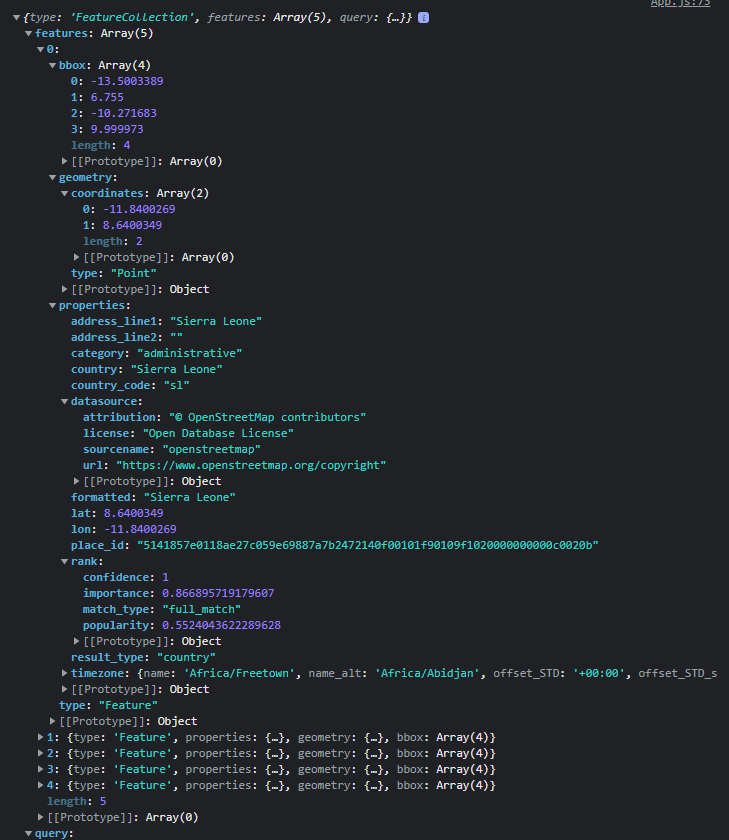

## Introduction

My final project for the Flatiron Software Engineering course has been a [website that takes in user survey data about their English dialect and plots it on a map of where they live, where they were born, and where their parents are from](https://dialect-map.onrender.com/). It still has a lot of room for improvement and enhancement, but I am hoping it will generate some fun conversations among the people who use it. An essential function of the site was changing user-entered locations, which could be cities, countries, regions or anything else, into map markers. Creating such a system myself was far beyond the scope of this project, so I began researching APIs that could do this task for me. In the end, I decided on [https://www.geoapify.com/](https://www.geoapify.com/), which uses the user-created map data from [https://www.openstreetmap.org/](https://www.openstreetmap.org/) (which I also used in my project) and others to send large, multifaceted data objects in response to location queries. In this post I will explain how I learned to do it and some pitfalls I encountered along the way.

## What are map coordinates, anyway?

As a child of the not yet information age, I learned of map coordinates in terms of degrees and minutes north and south of the equator, or west or east of the prime meridian, written like 47°36′35″N 122°19′59″W. However, the sample input for one of [React Leaflet's](https://react-leaflet.js.org/) map markers looked like this:

```
    <Marker position='51.505, -0.09'>
```

Maybe it's just because I was tired at the time from a long day of coding, but at first I couldn't imagine the relationship between these two things at all. Also, I didn't know what to call this method of positioning in order to Google it, and everything I tried resulted in articles about positioning coordinates inside the browser window, which is also useful, but not what I was looking for. After an hour or two of searching I discovered (through Wikipedia, of course) that that is referred to as "decimal degrees", and the second coordinate is positive for the eastern hemisphere and negative for the western. So far, so good.

## The Geoapify Geocoding Fetch Request

Geoapify offers a few different map related APIs. Two of them are geocoding, and _reverse_ geocoding. Geocoding refers to entering a place name and recieving coodinates, while reverse geocoding is entering coordinates and recieving place information. My project called for the former. I settled on the following fetch request:

```
  // converts place names into map coordinates
    function geocoder(placeName){
        fetch(`https://api.geoapify.com/v1/geocode/search?text=${placeName}&apiKey=${process.env.REACT_APP_GEOCODE_API_KEY}`)
        .then(response => response.json())
        .then(result => {
        if (result.features.length > 0){
            setProperties((properties) => [...properties, {...result.features[0].properties, placeName}])
        }
        })
    }
```

An earlier version mistakenly had the API key written in directly, and I got to discover the exciting world of Git history reconstuction! But that's a story for another day. Once I recieved the data object, I chose just a small part of it (result.features\[0\].properties) to use in my site. In the next section I'll show why. Also, I realized that I needed the "properties" state to include placeName, which is the exact string the user entered, in order to properly reference the users with the places they recorded. More on that later.

## The geocode data object

I had worked with external APIs before, including for a movie database, so I was expecting to recieve more information from the API than I really needed. I was not prepared for just how big and confusing the object I recieved was. Here is just a sample:



First, the object was an array of five "features", which represent its top five guesses about what the place name referred to (Georgia the US state, Georgia the country in Europe, etc). I don't know its internal logic for choosing one over the other, but for simplicity, I chose just the first one. At first though, I assumed that the geometry.coordinates section was the coordinates associated with the place, but using that resulted in wildly inaccurate output, like the city of Madrid being near the North Pole. I settled on properties.lat and properties.lon, which upon testing seemed to represent the geographic center of whatever location I put in.

## Rendering the markers

Armed with these coordinates, I built a function to render the react-leaflet map markers:

```
    // renders markers and their popups on the map
    function renderMarkers(){

        return properties.map(property  =>{
            // console.log(property)
            return (<Marker key = {property.place_id} 
                    position={[property.lat, property.lon]}
                    alt={property.formatted}
                    title={property.formatted}


                    >
                        <Popup id= {property.formatted} >
                        {property.formatted}<br/>

                        <Link to={`/survey_responses/${property.placeName}`} property={property}>Survey Responses for this place</Link>
                        </Popup>
                    </Marker>)
            })
    }
```

Property.formatted, which I used for the marker names and alt data, represents the place name as formatted by the API. For countries it typically is just a string of the country name, but for regions or cities it appends the higher order information, for example a user input of "Denver" results in property.formatted of "Denver, CO, United States of America". This is important to remember because for other parts of my website I needed to match these markers with the users that created them, and property.formatted often did not match what was in the user database table.

## Conclusion

In some ways, using geocoding was easier than I expected. Geoapify's somehow handled even confusing or ambiguous queries (Muskogee, China still somehow resulted in a location inside China) rather than returning nothing, and I was able to link all the map markers back successfully to the users who created them. In future projects I hope to make better use of the bounty of information in the geocoding object and add more dynamic programming to the map.

As usual, I hope that this post helps someone else who is struggling with the wild world of web development.
